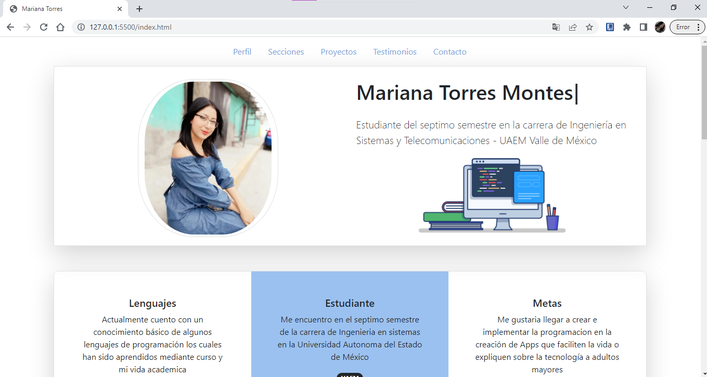
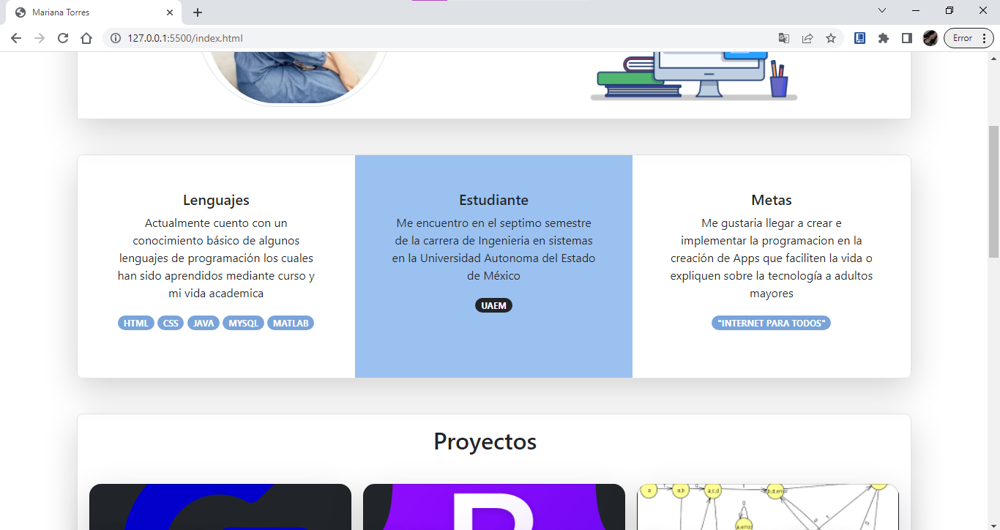
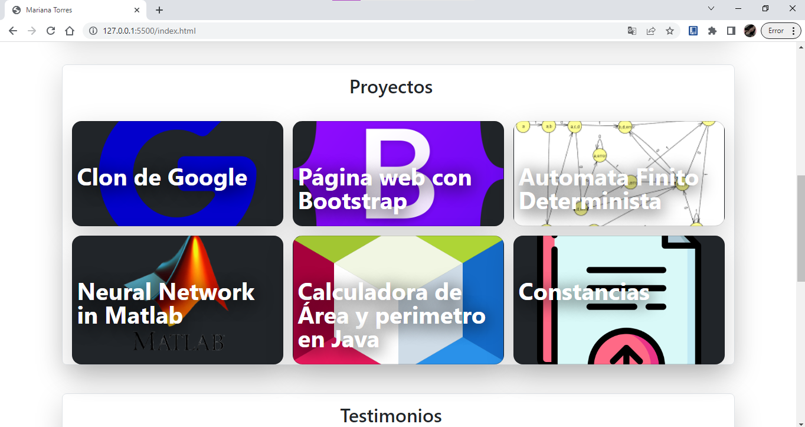

# Portafolio Responsivo con Bootstrap 5

El presente proyecto es creado para el Bootcamp de **Tecnolochicas PRO Summer Camp**

* [1. Introducción](https://github.com/MarianaTom/portafolio/edit/main/README.md#1-introducci%C3%B3n)
* [2. Tecnologás utilizadas en el proyecto](https://github.com/MarianaTom/portafolio/edit/main/README.md#2-tenolog%C3%ADas-utilizadas-para-el-proyecto)
* [3. Demo](https://github.com/MarianaTom/portafolio/edit/main/README.md#3-demo)
* [4. Español](https://github.com/marianatom/clon-de-google/tree/main#4-objetivos-de-aprendizaje)
* [5. Requisitos](https://github.com/MarianaTom/portafolio/edit/main/README.md#5-requisitos)
* [6. Contacto](https://github.com/MarianaTom/portafolio/edit/main/README.md#6-contacto)

## 1. Introducción 

Es una página web responsiva (adaptable a diversos tamaños de pantalla). 🖥💻📱

El proposito de el sitio web es mostrar el portafolio de proyectos de un(a) desarrollador(a) y su experiencia. 😎🤓

Incluye una descripción de su motivacion, experiencia, proyectos, árticulos publicados y formas de contacto. 📞📲

Tambien contiene una sección de almacenamiento de archivos *(imágenes)* que nos permiten modificar la imagen de perfil del desarrollador y contiene una animación desarrollada con JavaScrip 

Para visitar mi página web visita el siguiente Link 👉 https://vocal-pie-7e740c.netlify.app

## 2. Tenologías utilizadas para el proyecto 

Esta página fue creada con: 
* HTML 5
* CSS 3
* JavaScrip 
* Bootstrap 5

Ademas se incluyen "Google Fonts" 

## 3. Demo 
Aqui podras observar las capturas de pantalla sobre el como se veria esta pagína web con Bootstrap!
###### Cada proyecto te direcciona a los repositorios en "Github"

## 4. Español
El texto de la página web esta escrito en español, sin embargo las clases relacionadas con BootStrap se incluyen en inglés. 🌸

## 5. Requisitos
Usa esta lista para saber los requisitos mínimos del proyecto:
### UI
- [ ] Aplicar en todo el sitio HTML semántico de estándar no.5 (HTML5).
- [ ] Aplicar tipos de selectores en CSS.
- [ ] Sección `Header`, `main`, `footer`
- [ ] Tener a la mano los elementos de Bootstrap necesarios para tu proyecto
- [ ] Aplicar tu estilo de animación en un archivo tipo 'js'

####

## 6. Contacto
Desarrollado por: "Mariana Torres" en Tecnolochicas Summer Pro  💜💜💜
[Mariana Torres](https://github.com/MarianaTom)
